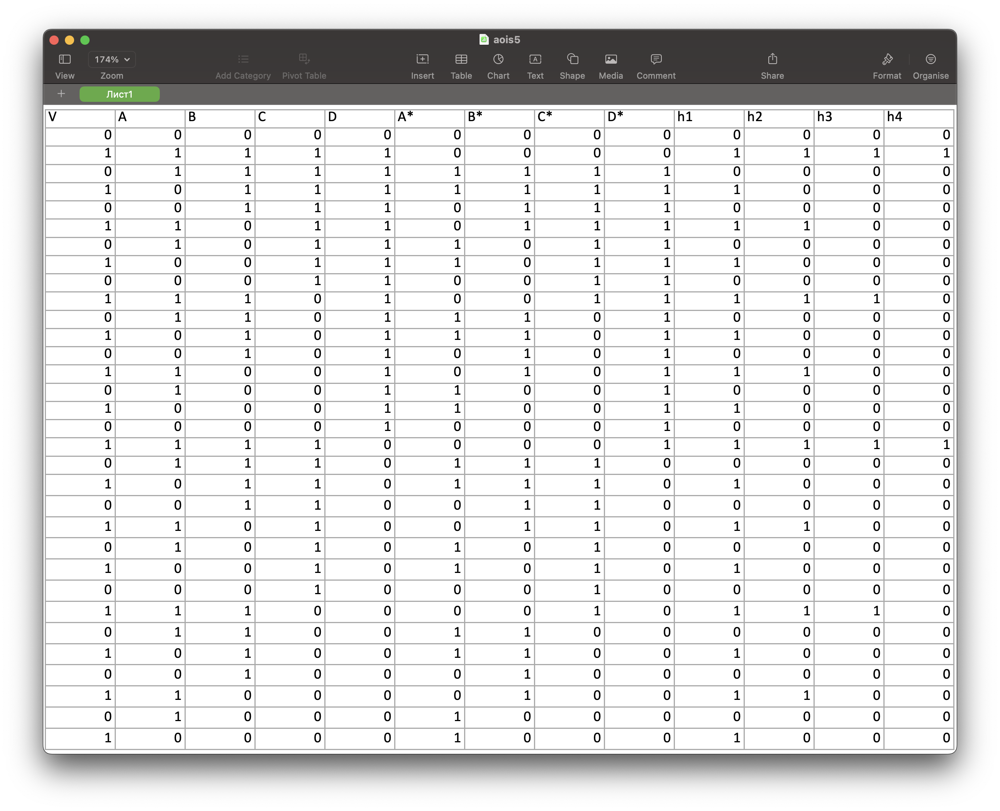
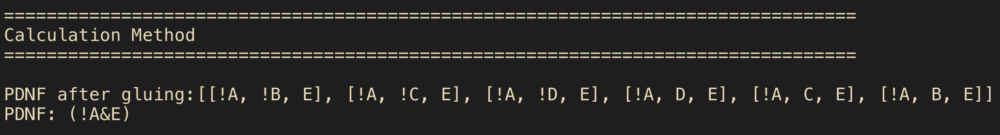
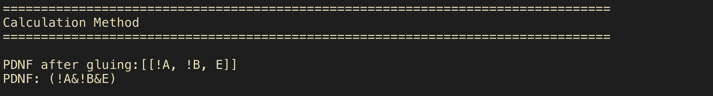
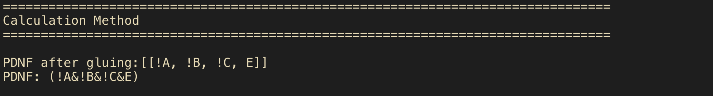

# LR5

## Таблица истинности (переходов)

h1: (!A&!B&!C&!D&V)|(A&B&C&D&V)|(!A&B&C&D&V)|(A&!B&C&D&V)|(!A&!B&C&D&V)|(A&B&!C&D&V)|(!A&B&!C&D&V)|(A&!B&!C&D&V)|(!A&!B&!C&D&V)|(A&B&C&!D&V)|(!A&B&C&!D&V)|(A&!B&C&!D&V)|(!A&!B&C&!D&V)|(A&B&!C&!D&V)|(!A&B&!C&!D&V)|(A&!B&!C&!D&V)
-> V

h2: (!A&!B&!C&!D&V)|(!A&B&C&D&V)|(!A&!B&C&D&V)|(!A&B&!C&D&V)|(!A&!B&!C&D&V)|(!A&B&C&!D&V)|(!A&!B&C&!D&V)|(!A&B&!C&!D&V)
-> (V&!A)

h3: (!A&!B&!C&!D&V)|(!A&!B&C&D&V)|(!A&!B&!C&D&V)|(!A&!B&C&!D&V)
-> (V&!B&!A)

h4: (!A&!B&!C&!D&V)|(!A&!B&!C&D&V)
-> (V&!C&!B&!A)

### Пример минимализации

h2:

h3:

h4:

(E = V)
